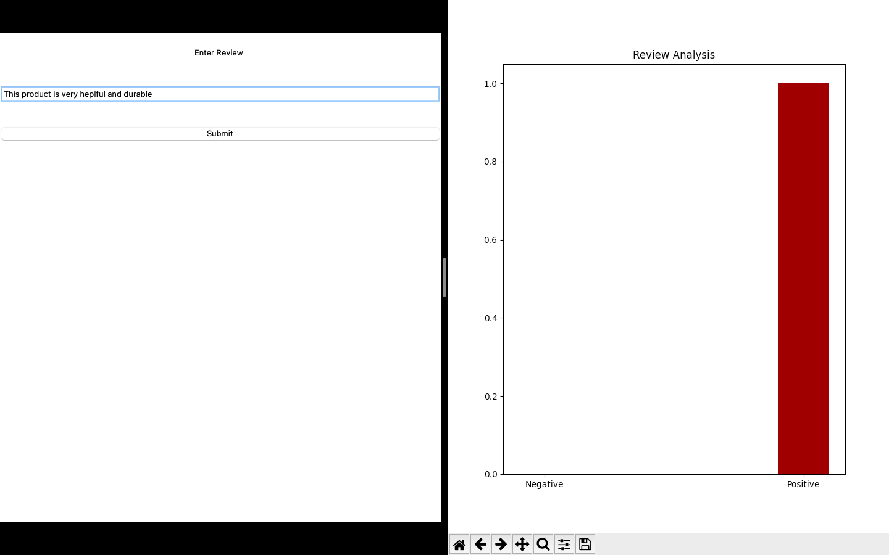
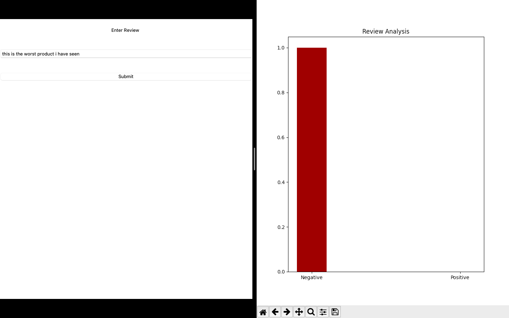
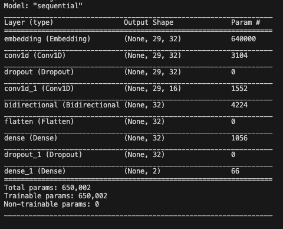

# Sentiment Analysis DeepLearning

## Introduction
 My project focuses on sentiment analysis, aiming to determine the likelihood of a review being positive or negative. Leveraging a dataset comprising over 40,000 labeled statements, you've implemented Long Short-Term Memory (LSTM) layers in your model. LSTM is a type of recurrent neural network (RNN) designed to capture and analyze sequential data, making it particularly well-suited for tasks like sentiment analysis that involve understanding the context and dependencies within text. Through the training and utilization of LSTM layers, your project seeks to enhance the accuracy of sentiment predictions for a diverse range of statements, contributing to the field of natural language processing and sentiment classification.

## Features

- Utilizes a machine learning model for sentiment analysis using LSTM and Embedding Layer.
- Dataset with over 40,000+ labeled statements.
- Probabilistic prediction of positive or negative sentiment.
- Inputs the review data using a simple tkinter gui

## Installations

- Download predict.py
- Download model2.h5

## How to Run

- Run the predict.py file in VScode and keep the model2.h5 file in the same folder

## About Dataset
- Amazon Reviews Dataset of 40000+ reviews that have been refined and edited by me

## Architecture
